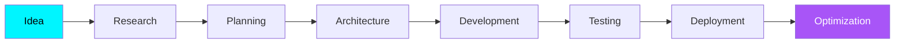

<!-- ========================================================= -->
<!--               🚀 PREMIUM GITHUB PROFILE - PART 1           -->
<!--                   Designed for Abhishek                   -->
<!-- ========================================================= -->

<div align="center">


<br>


<br><br>


</div>

---

#  Hello, I'm Abhishek


### Software Engineer building scalable products powered by AI.

I enjoy transforming ideas into reliable software through clean architecture,
modern backend systems, and intuitive user experiences.

My interests revolve around:

- 🤖 Artificial Intelligence
- ⚙️ Backend Engineering
- 🌐 Full Stack Development
- 🗄️ Database Design
- ☁️ Cloud Technologies
- 📈 Performance Optimization

Currently focused on building production-ready applications using modern technologies while continuously improving software engineering skills.

<br clear="right"/>

---

# 🌌 Navigation

<p align="center">

<a href="#-about-me">About</a> •
<a href="#-tech-universe">Tech Stack</a> •
<a href="#-featured-projects">Projects</a> •
<a href="#-experience">Experience</a> •
<a href="#-education">Education</a> •
<a href="#-github-analytics">Analytics</a> •
<a href="#-contact">Contact</a>

</p>

---

<div align="center">

## ⚡ Engineering Mindset

<table>

<tr>

<td align="center" width="25%">


### Build

Designing reliable software with scalable architecture.

</td>

<td align="center" width="25%">


### Create

Crafting modern user experiences with performance in mind.

</td>

<td align="center" width="25%">


### Optimize

Designing efficient databases and backend systems.

</td>

<td align="center" width="25%">


### Improve

Learning continuously through real-world development.

</td>

</tr>

</table>

</div>

---

<div align="center">

# ⚙️ Current Focus

```text
━━━━━━━━━━━━━━━━━━━━━━━━━━━━━━━━━━━━━━━━━━━━━━━━━━━━━━

🧠 Building AI-Powered Applications

███████████████████████░░░░░░░ 80%

⚙️ Java Backend Development

██████████████████████████░░░░ 88%

🌐 Full Stack Engineering

█████████████████████████░░░░░ 84%

🗄️ Database Architecture

███████████████████████████░░░ 90%

🚀 Learning New Technologies

██████████████████████████████ 100%

━━━━━━━━━━━━━━━━━━━━━━━━━━━━━━━━━━━━━━━━━━━━━━━━━━━━━━
```

</div>

---

<div align="center">

### 💡 "Great software is not just written — it is engineered."

</div>


<!-- END OF PART 1 -->

<!-- ========================================================= -->
<!--                🚀 PREMIUM GITHUB PROFILE - PART 2          -->
<!-- ========================================================= -->

<a name="-about-me"></a>

#  About Me

<div align="center">

<table>
<tr>

<td width="62%">

### 👨‍💻 Software Engineer

I'm **Abhishek**, a Software Engineer passionate about building scalable backend systems, AI-powered applications, and modern full-stack products.

My development philosophy is simple:

> **Write maintainable code. Build meaningful products. Never stop learning.**

I enjoy solving real-world problems using software while continuously improving my understanding of system design, backend architecture, databases, and AI integration.

---

### 🚀 Currently

- 🌱 Learning advanced backend engineering
- 🤖 Exploring AI application development
- ⚡ Building scalable full-stack applications
- 🏗️ Improving software architecture skills
- 📚 Solving DSA regularly

</td>

<td align="center">


</td>

</tr>
</table>

</div>

---

<a name="-tech-universe"></a>

# 🌌 Tech Universe

<div align="center">


</div>

---

# ⚡ Technology Radar

<div align="center">

| Category | Technologies |
|-----------|--------------|
| 💻 Languages | Java • Python • JavaScript • TypeScript • SQL |
| 🎨 Frontend | HTML • CSS • React • Next.js |
| ⚙️ Backend | Node.js • Express.js • REST APIs |
| 🗄 Database | PostgreSQL • MySQL • MongoDB |
| 🤖 AI | Gemini API |
| 🔐 Authentication | Clerk |
| 🔄 ORM | Prisma |
| 🚀 Deployment | Vercel |
| 🛠 Tools | Git • GitHub • VS Code • Maven • Postman |

</div>

---

# 🧠 Engineering Principles

<div align="center">

<table>

<tr>

<td align="center">


### Clean Code

Readable

Reusable

Maintainable

</td>

<td align="center">


### Database First

Normalized

Optimized

Reliable

</td>

<td align="center">


### User Focused

Responsive

Accessible

Modern

</td>

<td align="center">


### Continuous Learning

Experiment

Improve

Build

</td>

</tr>

</table>

</div>

---

# 📊 Skills Matrix

| Skill | Level |
|------|------|
| Java | ████████████████████ 95% |
| SQL | ███████████████████ 92% |
| React | ██████████████████ 90% |
| Next.js | ██████████████████ 90% |
| Node.js | █████████████████ 88% |
| Express.js | █████████████████ 87% |
| PostgreSQL | ██████████████████ 90% |
| MySQL | ██████████████████ 90% |
| Git & GitHub | ██████████████████ 90% |
| REST APIs | ███████████████████ 93% |

---

# 🏗 Software Engineering Stack

```text
                     Internet
                         │
                         ▼
                Next.js + React
                         │
──────────────────────────────────────────
             REST API Layer
──────────────────────────────────────────
          Express.js / Node.js
                         │
──────────────────────────────────────────
        Authentication & Security
──────────────────────────────────────────
          Clerk • RBAC • JWT
                         │
──────────────────────────────────────────
          Business Logic Layer
──────────────────────────────────────────
     AI Services • Validation • ORM
                         │
──────────────────────────────────────────
             Prisma ORM
                         │
──────────────────────────────────────────
      PostgreSQL / MySQL Database
──────────────────────────────────────────
```

---

# ⚙️ Development Workflow

```text
Idea 💡
 │
 ▼
Planning
 │
 ▼
Architecture
 │
 ▼
Development
 │
 ▼
Testing
 │
 ▼
Deployment
 │
 ▼
Monitoring
 │
 ▼
Optimization
```

---

# 🚀 Core Competencies

<div align="center">

| Backend | Frontend | Database | AI | Tools |
|---------|----------|----------|----|------|
| Java | React | PostgreSQL | Gemini API | Git |
| Node.js | Next.js | MySQL | AI Integration | GitHub |
| Express | HTML/CSS | MongoDB | Automation | Postman |
| REST APIs | TypeScript | Prisma | Prompt Engineering | Vercel |

</div>

---

<div align="center">

## ⚡ Favorite Quote

> **"Software engineering is the art of solving problems elegantly, one commit at a time."**

</div>


<!-- END PART 2 -->

<!-- ========================================================= -->
<!--                🚀 PREMIUM GITHUB PROFILE - PART 3          -->
<!-- ========================================================= -->

<a name="-featured-projects"></a>

# 🚀 Featured Projects

<div align="center">

### Building products that solve real-world problems through software, AI, and scalable architecture.

</div>

---

<table>

<tr>

<td width="50%">

# 🤖 Career Forge

### AI Powered Career Development Platform


### 🚀 Highlights

- 🤖 AI Resume Analysis
- 💼 Interview Preparation
- 🎯 Career Recommendations
- 📊 Personalized Insights
- 🔐 Secure Authentication
- 📈 User Analytics
- ⚡ Background Job Processing
- 🌐 Responsive Dashboard

---

### ⚙ Tech Stack

<p>


</p>

---

### Architecture

```text
Client
   │
Next.js
   │
REST APIs
   │
Prisma ORM
   │
PostgreSQL
   │
Gemini AI
```

</td>

<td width="50%">

# ⚡ Vidyut Bill

### Smart Electricity Billing System


### 🚀 Features

- 👥 Customer Management
- ⚡ Electricity Billing
- 💳 Payment Tracking
- 📊 Reports
- 🔐 Admin Authentication
- 📁 CRUD Operations
- 🗄 Database Integration
- 🧾 Invoice Generation

---

### ⚙ Tech Stack

<p>


</p>

---

### Architecture

```text
Java Swing
     │
Business Logic
     │
JDBC
     │
MySQL
```

</td>

</tr>

</table>

---

# 🏗 Software Development Journey

```text
2021
 │
 ├── Started Computer Science
 │
2022
 │
 ├── Java
 ├── SQL
 ├── OOP
 │
2023
 │
 ├── Web Development
 ├── React
 ├── Node.js
 │
2024
 │
 ├── Next.js
 ├── PostgreSQL
 ├── Full Stack Development
 │
2025
 │
 ├── AI Integration
 ├── Prisma
 ├── REST APIs
 │
2026
 │
 ├── Career Forge
 ├── IEEE Research
 ├── JioStar Experience
 └── Production Software
```

---

<a name="-experience"></a>

# 💼 Professional Experience

<div align="center">

## Backend Operations Associate

### JioStar India Pvt. Ltd.

**January 2026 — May 2026**

</div>

---

### 🚀 Responsibilities

- 📊 Campaign performance analysis
- 📈 KPI reporting
- 📺 Broadcast operations
- 💰 Revenue reconciliation
- 📋 Dashboard development
- ⚡ Operational reporting
- 📡 Campaign monitoring
- ✅ Quality assurance

---

### 🌍 Worked With

<div align="center">

Samsung • Apple • Coca-Cola • Havells • Wonder Cement • WPP Media

</div>

---

### 📺 Mega Events

🏏 TATA IPL 2026

🏆 ICC Men's T20 World Cup 2026

---

### Impact

```text
✔ 2500+ Advertisement Placements

✔ 99%+ Placement Accuracy

✔ Enterprise Campaign Operations

✔ Live Broadcast Monitoring

✔ Dashboard Automation
```

---

<a name="-education"></a>

# 🎓 Education

<table>

<tr>

<td width="50%" align="center">

## 🎓 Master of Computer Applications

BVICAM

IP University

2024 — 2026

</td>

<td width="50%" align="center">

## 💻 B.Sc Computer Science

Atma Ram Sanatan Dharma College

University of Delhi

2021 — 2024

</td>

</tr>

</table>

---

# 🏆 Achievements

<table>

<tr>

<td align="center">

## 📄 IEEE Research

Published research on

**Smart Grid Systems**

Real-Time Energy Optimization

</td>

<td align="center">

## ☁ NPTEL Elite

Cloud Computing

Distributed Systems

**87% Score**

Top 5%

</td>

</tr>

</table>

---

# 📈 Development Philosophy

```text
Think
   │
Design
   │
Code
   │
Test
   │
Optimize
   │
Deploy
   │
Repeat
```

---

# 🌟 Beyond Coding

- 💡 Exploring Artificial Intelligence
- 📚 Learning Software Architecture
- ⚙ Backend Engineering
- 🌐 Building Full Stack Applications
- 🚀 Open Source Enthusiast
- 📈 Continuous Learning

---

<div align="center">

### ✨ "Every project is an opportunity to learn something new."

</div>


<!-- END PART 3 -->

<!-- ========================================================= -->
<!--                🚀 PREMIUM GITHUB PROFILE - PART 4          -->
<!-- ========================================================= -->

<a name="-github-analytics"></a>

#  GitHub Analytics

<div align="center">


</div>

---

# 🔥 Contribution Streak

<div align="center">


</div>

---

# 📈 Contribution Activity

<div align="center">


</div>

---

# 🏆 GitHub Achievements

<div align="center">


</div>

---

# ⚡ Development Dashboard

<div align="center">

| Metric | Status |
|:------|:------:|
| 🚀 Active Development | 🟢 |
| 💻 Full Stack Projects | 🟢 |
| 🤖 AI Integration | 🟢 |
| ⚙ Backend Engineering | 🟢 |
| 🗄 Database Design | 🟢 |
| 🌐 Open Source | 🟢 |
| 📚 Continuous Learning | 🟢 |

</div>

---

# 📊 Engineering Focus

<div align="center">

```text
Backend Engineering         ████████████████████████░░ 90%

Full Stack Development      ██████████████████████░░░ 88%

Artificial Intelligence     ███████████████████░░░░░░ 76%

System Design               ████████████████████░░░░░ 82%

Database Architecture       ███████████████████████░░ 89%

REST API Development        ████████████████████████░ 93%

Cloud Technologies          ██████████████████░░░░░░░ 74%

Problem Solving             ███████████████████████░░ 91%
```

</div>

---

# 💻 Coding Profile

<div align="center">


</div>

---

# 🌍 Tech Ecosystem

<div align="center">

```text
                    ┌────────────────────┐
                    │     Frontend       │
                    │ React • Next.js    │
                    └─────────┬──────────┘
                              │
                              ▼
                    ┌────────────────────┐
                    │     Backend        │
                    │ Node • Express     │
                    └─────────┬──────────┘
                              │
                              ▼
                    ┌────────────────────┐
                    │     Database       │
                    │ PostgreSQL MySQL   │
                    └─────────┬──────────┘
                              │
                              ▼
                    ┌────────────────────┐
                    │   AI Integration   │
                    │ Gemini • APIs      │
                    └─────────┬──────────┘
                              │
                              ▼
                    ┌────────────────────┐
                    │ Deployment & DevOps│
                    │ Git • Vercel       │
                    └────────────────────┘
```

</div>

---

# ⚙ Development Cycle

<div align="center">



</div>

---

# 📌 Current Priorities

<div align="center">

| 🎯 Goal | Progress |
|----------|----------|
| AI Applications | ██████████████░░ |
| Java Backend | ███████████████ |
| Full Stack | ██████████████░ |
| System Design | ███████████░░░ |
| Open Source | ██████████░░░░ |

</div>

---

# 🌟 2026 Roadmap

```text
✅ Advanced Java

✅ Backend Architecture

✅ AI Powered Applications

✅ Modern Full Stack Development

⬜ Cloud Native Engineering

⬜ Microservices

⬜ Kubernetes

⬜ Distributed Systems

⬜ High Scale Applications
```

---

# 💬 Favorite Engineering Quote

<div align="center">

> **"Good software is built twice — first in the mind, then in code."**

</div>

---

<div align="center">


</div>

<!-- END PART 4 -->

<!-- ========================================================= -->
<!--                🚀 PREMIUM GITHUB PROFILE - PART 5          -->
<!-- ========================================================= -->

<a name="-my-philosophy"></a>

#  My Philosophy

<div align="center">

<table>

<tr>

<td align="center" width="25%">

### 💡 Learn

Every project teaches something valuable.

</td>

<td align="center" width="25%">

### ⚡ Build

Ideas become meaningful only after execution.

</td>

<td align="center" width="25%">

### 🚀 Improve

Continuous improvement beats perfection.

</td>

<td align="center" width="25%">

### 🌍 Share

Knowledge grows when shared.

</td>

</tr>

</table>

</div>

---

# 🧠 Engineering Mindset

```text
Problems
   │
   ▼
Research
   │
   ▼
Design
   │
   ▼
Architecture
   │
   ▼
Implementation
   │
   ▼
Testing
   │
   ▼
Optimization
   │
   ▼
Deployment
```

---

# 🏗 What I Love Building

<div align="center">

| 🚀 Domain | ❤️ Interest |
|------------|-------------|
| Full Stack Applications | ⭐⭐⭐⭐⭐ |
| Backend Systems | ⭐⭐⭐⭐⭐ |
| Artificial Intelligence | ⭐⭐⭐⭐⭐ |
| REST APIs | ⭐⭐⭐⭐⭐ |
| Database Design | ⭐⭐⭐⭐⭐ |
| Developer Tools | ⭐⭐⭐⭐☆ |
| Automation | ⭐⭐⭐⭐☆ |
| Cloud Computing | ⭐⭐⭐⭐☆ |

</div>

---

# ⚙️ Tech Toolbox

<div align="center">


</div>

---

# 🎯 What Drives Me

> Building software that is not only functional but scalable, maintainable, and enjoyable to use.

---

# 📚 Currently Exploring

```text
☁ Cloud Technologies

🤖 AI Powered Applications

🏗 System Design

⚙ Backend Architecture

📦 Scalable APIs

🔒 Authentication Systems

🧩 Software Design Patterns

🚀 High Performance Applications
```

---

# 🌍 Open Source Goals

```text
█████████████████████████████

✔ Learn from Developers

✔ Contribute to Projects

✔ Share Knowledge

✔ Build Useful Tools

✔ Grow Consistently

█████████████████████████████
```

---

# 🧩 Fun Facts

<div align="center">

<table>

<tr>

<td align="center">

☕ Coffee

+

💻 Code

=

😊

</td>

<td align="center">

🌙

Night Coding

Enjoyer

</td>

<td align="center">

⚡

Clean Code

Advocate

</td>

<td align="center">

🚀

Always

Learning

</td>

</tr>

</table>

</div>

---

# 💼 Looking For

- 🚀 Software Engineering Roles
- 🤖 AI Engineering Opportunities
- 🌐 Full Stack Development
- ⚙ Backend Development
- ☁ Cloud Engineering
- 🤝 Open Source Collaboration

---

# 🌐 Connect With Me

<a name="-contact"></a>

<div align="center">

<a href="https://abhishekyadav.me">

</a>

<a href="https://github.com/Abhish3k-Yadav">

</a>

<a href="https://linkedin.com/in/AbhishekYadav">

</a>

<a href="mailto:abhish3kkyadav@gmail.com">

</a>

</div>

---

# 💬 Let's Build Something Amazing

<div align="center">

*"Technology changes every day, but curiosity keeps developers relevant."*

<br>


</div>

---

# 🎵 Coding Playlist

<div align="center">

```text
█████████████████████████████████

🎧 Lo-Fi

🎧 Instrumental

🎧 Ambient

🎧 Synthwave

█████████████████████████████████
```

</div>

---

# 🌌 Thanks For Visiting

<div align="center">

### ⭐ If you like my work, consider following my journey!


<br><br>


</div>

<!-- ========================================================= -->
<!--                    END OF README.md                        -->
<!-- ========================================================= -->
