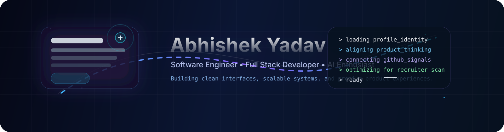
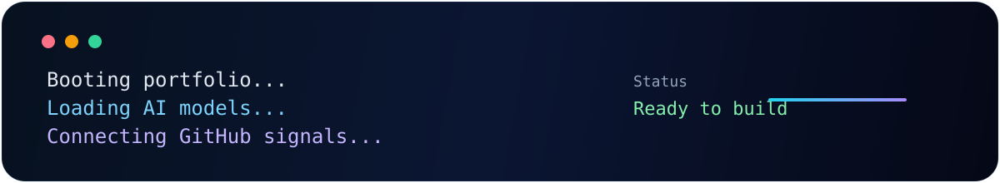
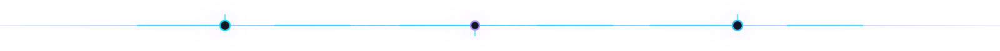
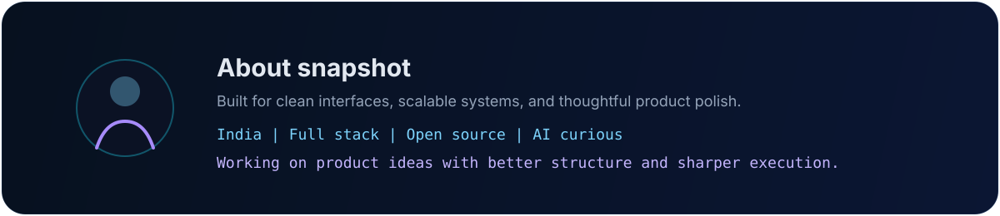
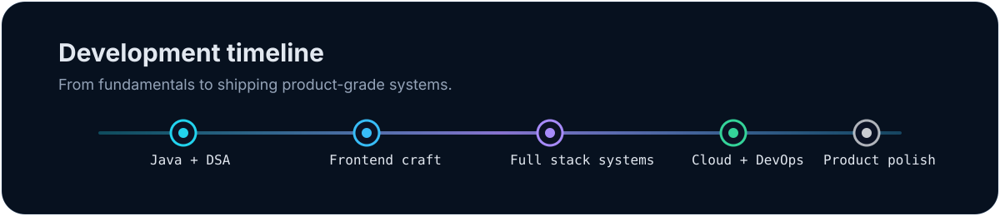
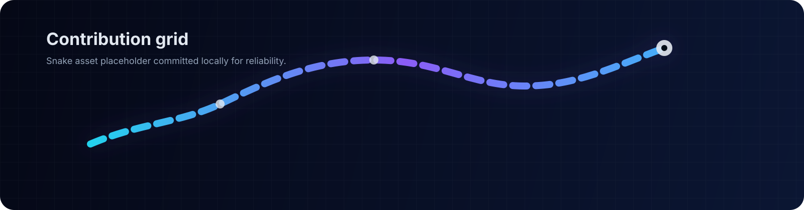
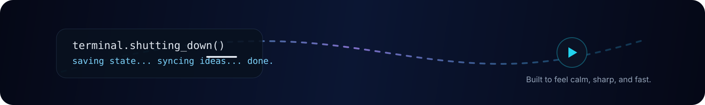

  

# Abhishek Yadav

### Software Engineer focused on premium UI, scalable backend systems, and product polish.

I build modern web experiences with a strong product mindset, clean architecture, and a bias toward shipping work that feels calm, fast, and intentional.

[Resume](mailto:abhish3kkyadav@gmail.com?subject=Resume%20Request) · [Repository](https://github.com/Abhish3k-Yadav/Abhish3k-Yadav) · [Email](mailto:abhish3kkyadav@gmail.com) · [LinkedIn](https://www.linkedin.com/in/abhishek-yadav-54974a333) · [GitHub](https://github.com/Abhish3k-Yadav)

## At a glance

- Country: India
- Current work: Grid-Magic and LeadDesk-Mini
- Learning: Docker, Kubernetes, cloud workflows, and AI tooling
- Goal: Product-grade software with sharp UX and durable architecture

  

## About

  

### What I build

- Frontend systems that feel deliberate instead of decorative.
- Backend flows that stay clear under real usage.
- Public portfolio pieces that look good and hold up under review.
- Interfaces that help recruiters understand the value quickly.

### How I work

- Small, testable iterations over noisy all-at-once changes.
- Spacing, hierarchy, and the first five seconds of trust.
- Clarity, speed, and maintainability at the same time.
- Codebases that stay readable after the first successful deploy.

## Now / Next

  

- Now: building product interfaces and refining delivery quality.
- Next: stronger cloud depth, more automation, and better observability.
- Always: clean architecture, sharp UX, and reliable public work.

  

## Tech Stack

  

### Languages and core engineering

Java, JavaScript, TypeScript, Python, C++, and C.

### Frontend

React, Next.js, HTML, CSS, Tailwind CSS, and Vite.

### Backend and data

Node.js, Express, Spring, MySQL, PostgreSQL, and MongoDB.

### Cloud, DevOps, and tools

Docker, Kubernetes, AWS, Git, GitHub, VS Code, Figma, Postman, and Linux.

## Featured Projects

### Grid-Magic

A layout-heavy frontend build focused on spatial systems, visual rhythm, and interface polish.

Focus: component architecture, responsive composition, motion restraint, and UI consistency.

[View on GitHub](https://github.com/Abhish3k-Yadav/Grid-Magic)

### LeadDesk-Mini

A compact productivity workspace built around lead tracking, clean data flow, and practical UX.

Focus: form logic, state management, API flow, and readable interfaces.

[View on GitHub](https://github.com/Abhish3k-Yadav/LeadDesk-Mini)

### CareerForge

A career-focused concept for structured growth, guidance, and clean content organization.

Focus: product structure, information hierarchy, content flow, and clarity.

[View on GitHub](https://github.com/Abhish3k-Yadav/CareerForge)

### VidyutBill

A utility-oriented billing project centered on practical workflows and business logic clarity.

Focus: forms, SQL, domain modeling, and straightforward user flows.

[View on GitHub](https://github.com/Abhish3k-Yadav/VidyutBill)

  

## GitHub Signals

If you want live repository analytics, the most stable view is the GitHub profile itself and the project repos above. I intentionally keep this README lightweight rather than stacking brittle widgets or heavy remote embeds.

  

## Research and learning

- IEEE research: Smart Grid Optimization.
- Learning focus: cloud fundamentals, Docker, Kubernetes, system design, and deployment discipline.
- Open source posture: ship publicly, refine quickly, and keep the feedback loop short.

## Contact

Fastest response: [abhish3kkyadav@gmail.com](mailto:abhish3kkyadav@gmail.com)

Best context: [LinkedIn](https://www.linkedin.com/in/abhishek-yadav-54974a333) or [GitHub](https://github.com/Abhish3k-Yadav)

  

