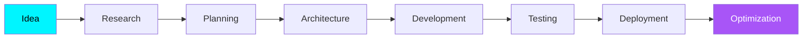

<div align="center">


<br>


<br><br>

<div align="center">


</div>

</div>

</div>

</div>

</div>

---

#  Hi, I'm Abhishek

<table>

<tr>

<td width="58%">

### Software Engineer passionate about building intelligent, scalable software.

I enjoy turning ideas into production-ready applications through modern backend engineering, full-stack development, and AI integration.

My focus is on creating software that is:

- ⚡ Fast & Reliable
- 🔒 Secure by Design
- 📈 Scalable
- 🧩 Maintainable
- 🤖 AI Enhanced

From REST APIs and backend architecture to responsive web applications, I enjoy solving real-world problems through thoughtful engineering and continuous learning.

<br>

> ### 💙 *"Build solutions that scale. Write code that lasts."*

<br>


<td align="center" width="42%">


<br><br>


</td>

</tr>

</table>


<a name="-about-me"></a>

<div align="center">

# ⚡ Engineering Mindset

<table>

<tr>

<td align="center" width="25%">


### Build

Designing scalable backend systems with clean architecture and maintainable code.

</td>

<td align="center" width="25%">


### Create

Crafting responsive, intuitive, and modern user experiences.

</td>

<td align="center" width="25%">


### Optimize

Building efficient databases, APIs, and high-performance applications.

</td>

<td align="center" width="25%">


### Improve

Learning continuously through projects, experimentation, and real-world development.

</td>

</tr>

</table>

</div>

---
<div align="center">

# 🚀 Current Focus

```text
  🤖  AI ENGINEERING
  ▰▰▰▰▰▰▰▰▰▰▰▰▱▱▱▱   85%   Production AI Applications

  ⚙️  BACKEND DEVELOPMENT
  ▰▰▰▰▰▰▰▰▰▰▰▰▰▱▱▱   90%   Java • Spring Boot • Node.js

  🌐  FULL STACK DEVELOPMENT
  ▰▰▰▰▰▰▰▰▰▰▰▰▱▱▱▱   88%   React • Next.js • TypeScript

  🗄️  DATABASE DESIGN
  ▰▰▰▰▰▰▰▰▰▰▰▰▰▰▱▱   92%   PostgreSQL • MySQL • MongoDB

  ☁️  CLOUD & DEVOPS
  ▰▰▰▰▰▰▰▰▰▰▱▱▱▱▱▱   75%   Docker • AWS • GitHub Actions

  📚  CURRENTLY LEARNING
  ▰▰▰▰▰▰▰▰▰▰▰▰▰▰▰▰  100%   System Design • AI/ML • Microservices

```

<div align="center">

# 💻 Technology Ecosystem

<div align="center">


</div>

<br>


<br><br>


</div>

<br>

<div align="center">

# 🌍 What Drives Me


<br>

<table>
<tr>

<td width="25%" align="center">


### 🧠 Learn


Continuously expanding my knowledge through **hands-on development**, **system design**, and **AI technologies**.

</td>

<td width="25%" align="center">


### ⚙️ Engineer


Designing **scalable**, **secure**, and **maintainable** software with modern engineering practices.

</td>

<td width="25%" align="center">


### 🚀 Innovate


Building **real-world applications** powered by **Full Stack Development**, **Cloud**, and **Artificial Intelligence**.

</td>

<td width="25%" align="center">


### 🌟 Grow


Improving with **every project**, **every challenge**, and **every commit**.

</td>

</tr>
</table>

<br>


</div>

---

<div align="center">


<a name="-featured-projects"></a>

# 🚀 Featured Projects

<div align="center">


### Building software that solves real-world problems using Artificial Intelligence, Automation, Cloud, and Modern Full Stack Technologies.

</div>

---

<table>
<tr>

<td width="50%" valign="top">

<div align="center">

# 🤖 CareerForge

### AI Powered Career Development Platform


</div>

---

### ✨ Key Highlights

- 🤖 AI Resume Analysis
- 💼 AI Interview Preparation
- 🎯 Personalized Career Recommendations
- 📊 Smart Career Insights
- 🔐 Secure Authentication
- 📈 Analytics Dashboard
- ⚡ High Performance Architecture
- 📱 Fully Responsive Design

---

### ⚙️ Technology Stack

<p align="center">


</p>

---

### 🌟 Project Goals

✔ Build an AI-first Career Platform

✔ Improve Resume Quality

✔ Prepare Candidates for Interviews

✔ Deliver Personalized Career Guidance

---

<div align="center">

<a href="https://github.com/Abhish3k-Yadav/CareerForge">

</a>

</div>

</td>

<td width="50%" valign="top">


<div align="center">

# 📊 LeadDesk Mini

### Intelligent Lead Management Platform


</div>

---

### ✨ Key Highlights

- 📋 Lead Management
- 📊 CRM Dashboard
- 🔎 Advanced Search & Filters
- 📈 Sales Analytics
- ⚡ Fast Performance
- 📱 Responsive Interface
- 🔒 Secure Data Handling
- 🚀 Productivity Focused Workflow

---

### ⚙️ Technology Stack

<p align="center">


</p>

---

### 🌟 Project Goals

✔ Organize Customer Leads

✔ Improve Sales Workflow

✔ Increase Team Productivity

✔ Deliver Modern CRM Experience

---

<div align="center">

<a href="https://github.com/Abhish3k-Yadav/LeadDesk-Mini">

</a>

</div>

</td>

</tr>
</table>

<table>
<tr>

<td width="50%" valign="top">

<div align="center">

# ⚡ VidyutBill

### Smart Electricity Billing Management System


<br><br>

</div>

---

### ✨ Key Highlights

- ⚡ Smart Electricity Billing
- 👥 Customer Management
- 💳 Payment Tracking
- 🧾 Invoice Generation
- 📊 Reports & Analytics
- 🔍 Advanced Search
- 🔐 Secure Admin Login
- 🗄️ JDBC Database Integration

---

### ⚙️ Technology Stack

<p align="center">


</p>

---

### 🌟 Project Goals

✔ Automate Monthly Billing

✔ Reduce Manual Work

✔ Secure Customer Records

✔ Fast & Accurate Invoice Generation

---

<div align="center">

<a href="https://github.com/Abhish3k-Yadav/VidyutBill">


</div>

</td>

<td width="45%" valign="top">

<div align="center">

# 🏥 Medical ChatBot

### AI Powered Healthcare Assistant


<br>

</div>

---

### ✨ Key Highlights

- 🤖 AI Medical Appointment Booking
- 📅 Google Calendar Integration
- 💬 Intelligent Chat Assistant
- 🌐 Real-Time Connection Monitoring
- ⚡ Offline Fallback Responses
- 📱 Responsive Glassmorphism UI
- 🔒 Secure Environment Configuration
- ♿ Accessibility & Keyboard Support

---

### ⚙️ Technology Stack

<p align="center">


---

### 🌟 Project Goals

✔ Intelligent Appointment Scheduling

✔ AI-Powered Healthcare Assistant

✔ Real-Time Calendar Management

✔ Modern & Accessible User Experience

---

<div align="center">

<a href="https://github.com/Abhish3k-Yadav/Chat-Bot">

</a>

</div>

</td>

</tr>
</table>

<br>

## 🚀 More Projects Coming Soon....


---

# 🔥 Contribution Streak

<a name="contribution-snake"></a>

# 🐍 Contribution Snake

<div align="center">


<br><br>


<br><br>


<br><br>


</div>

---

---

# ⚡ Development Dashboard

<div align="center">

| Metric | Status |
|:------|:------:|
| 🚀 Active Development | 🟢 |
| 💻 Full Stack Projects | 🟢 |
| 🤖 AI Integration | 🟢 |
| ⚙ Backend Engineering | 🟢 |
| 🗄 Database Design | 🟢 |
| 🌐 Open Source | 🟢 |
| 📚 Continuous Learning | 🟢 |

</div>

---

# 📊 Engineering Focus

<div align="center">

```text
Backend Engineering         ████████████████████████░░ 90%

Full Stack Development      ██████████████████████░░░ 88%

Artificial Intelligence     ███████████████████░░░░░░ 76%

System Design               ████████████████████░░░░░ 82%

Database Architecture       ███████████████████████░░ 89%

REST API Development        ████████████████████████░ 93%

Cloud Technologies          ██████████████████░░░░░░░ 74%

Problem Solving             ███████████████████████░░ 91%
```

</div>

---

# 💻 Coding Profile

<div align="center">


</div>

---

# 🌍 Tech Ecosystem

<div align="center">

```text
                    ┌────────────────────┐
                    │     Frontend       │
                    │ React • Next.js    │
                    └─────────┬──────────┘
                              │
                              ▼
                    ┌────────────────────┐
                    │     Backend        │
                    │ Node • Express     │
                    └─────────┬──────────┘
                              │
                              ▼
                    ┌────────────────────┐
                    │     Database       │
                    │ PostgreSQL MySQL   │
                    └─────────┬──────────┘
                              │
                              ▼
                    ┌────────────────────┐
                    │   AI Integration   │
                    │ Gemini • APIs      │
                    └─────────┬──────────┘
                              │
                              ▼
                    ┌────────────────────┐
                    │ Deployment & DevOps│
                    │ Git • Vercel       │
                    └────────────────────┘
```

</div>

---

# ⚙ Development Cycle

<div align="center">



</div>

---

# 📌 Current Priorities

<div align="center">

| 🎯 Goal | Progress |
|----------|----------|
| AI Applications | ██████████████░░ |
| Java Backend | ███████████████ |
| Full Stack | ██████████████░ |
| System Design | ███████████░░░ |
| Open Source | ██████████░░░░ |

</div>

---

# 🌟 2026 Roadmap

```text
✅ Advanced Java

✅ Backend Architecture

✅ AI Powered Applications

✅ Modern Full Stack Development

⬜ Cloud Native Engineering

⬜ Microservices

⬜ Kubernetes

⬜ Distributed Systems

⬜ High Scale Applications
```

---

# 💬 Favorite Engineering Quote

<div align="center">

> **"Good software is built twice — first in the mind, then in code."**

</div>

---

<div align="center">


</div>

<!-- END PART 4 -->

<!-- ========================================================= -->
<!--                🚀 PREMIUM GITHUB PROFILE - PART 5          -->
<!-- ========================================================= -->

<a name="-my-philosophy"></a>

#  My Philosophy

<div align="center">

<table>

<tr>

<td align="center" width="25%">

### 💡 Learn

Every project teaches something valuable.

</td>

<td align="center" width="25%">

### ⚡ Build

Ideas become meaningful only after execution.

</td>

<td align="center" width="25%">

### 🚀 Improve

Continuous improvement beats perfection.

</td>

<td align="center" width="25%">

### 🌍 Share

Knowledge grows when shared.

</td>

</tr>

</table>

</div>

---

# 🧠 Engineering Mindset

```text
Problems
   │
   ▼
Research
   │
   ▼
Design
   │
   ▼
Architecture
   │
   ▼
Implementation
   │
   ▼
Testing
   │
   ▼
Optimization
   │
   ▼
Deployment
```

---

# 🏗 What I Love Building

<div align="center">

| 🚀 Domain | ❤️ Interest |
|------------|-------------|
| Full Stack Applications | ⭐⭐⭐⭐⭐ |
| Backend Systems | ⭐⭐⭐⭐⭐ |
| Artificial Intelligence | ⭐⭐⭐⭐⭐ |
| REST APIs | ⭐⭐⭐⭐⭐ |
| Database Design | ⭐⭐⭐⭐⭐ |
| Developer Tools | ⭐⭐⭐⭐☆ |
| Automation | ⭐⭐⭐⭐☆ |
| Cloud Computing | ⭐⭐⭐⭐☆ |

</div>

---

# ⚙️ Tech Toolbox

<div align="center">


</div>

---

# 🎯 What Drives Me

> Building software that is not only functional but scalable, maintainable, and enjoyable to use.

---

# 📚 Currently Exploring

```text
☁ Cloud Technologies

🤖 AI Powered Applications

🏗 System Design

⚙ Backend Architecture

📦 Scalable APIs

🔒 Authentication Systems

🧩 Software Design Patterns

🚀 High Performance Applications
```

---

# 🌍 Open Source Goals

```text
█████████████████████████████

✔ Learn from Developers

✔ Contribute to Projects

✔ Share Knowledge

✔ Build Useful Tools

✔ Grow Consistently

█████████████████████████████
```

---

# 🧩 Fun Facts

<div align="center">

<table>

<tr>

<td align="center">

☕ Coffee

+

💻 Code

=

😊

</td>

<td align="center">

🌙

Night Coding

Enjoyer

</td>

<td align="center">

⚡

Clean Code

Advocate

</td>

<td align="center">

🚀

Always

Learning

</td>

</tr>

</table>

</div>

---

# 💼 Looking For

- 🚀 Software Engineering Roles
- 🤖 AI Engineering Opportunities
- 🌐 Full Stack Development
- ⚙ Backend Development
- ☁ Cloud Engineering
- 🤝 Open Source Collaboration

---

# 🌐 Connect With Me

<a name="-contact"></a>

<div align="center">

<a href="https://abhishekyadav.me">

</a>

<a href="https://github.com/Abhish3k-Yadav">

</a>

<a href="https://linkedin.com/in/AbhishekYadav">

</a>

<a href="mailto:abhish3kkyadav@gmail.com">

</a>

</div>

---

# 💬 Let's Build Something Amazing

<div align="center">

*"Technology changes every day, but curiosity keeps developers relevant."*

<br>


</div>

---

# 🎵 Coding Playlist

<div align="center">

```text
█████████████████████████████████

🎧 Lo-Fi

🎧 Instrumental

🎧 Ambient

🎧 Synthwave

█████████████████████████████████
```

</div>

---

# 🌌 Thanks For Visiting

<div align="center">

### ⭐ If you like my work, consider following my journey!


<br><br>


</div>

<!-- ========================================================= -->
<!--                    END OF README.md                        -->
<!-- ========================================================= -->
