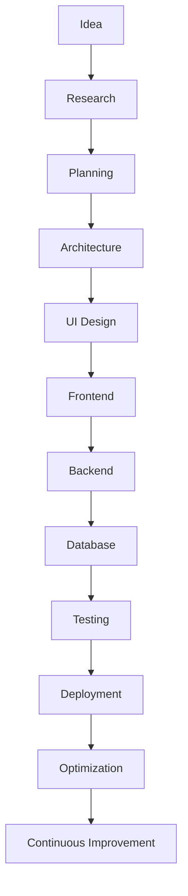
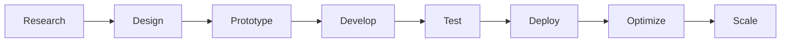
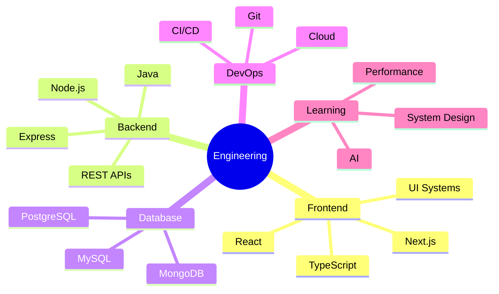
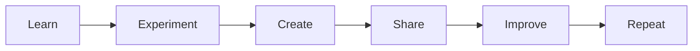

<!-- ========================================================= -->
<!--                  PREMIUM GITHUB README                     -->
<!--                       PART 1 OF 5                          -->
<!-- ========================================================= -->

<div align="center">


# 

<p align="center">


</p>

</div>

---

#  SYSTEM PROFILE

```yaml
Name: Abhishek
Role: Software Engineer
Specialization:
  - Full Stack Development
  - Backend Systems
  - Modern Frontend
  - Database Engineering
  - API Architecture

Mission:
  Building fast, scalable and visually polished software.

Mindset:
  Clean Code
  Performance
  Simplicity
  Continuous Learning

Current Mode:
  Designing.
  Building.
  Optimizing.
```

---

#  CORE PHILOSOPHY

<table>
<tr>
<td width="50%">

### ⚡ Engineering

- Build with intention
- Design for scale
- Write maintainable code
- Optimize before complexity
- Performance matters

</td>

<td width="50%">

### 🚀 Development

- User-first experiences
- Modern architecture
- Automation everywhere
- Pixel-perfect interfaces
- Continuous improvement

</td>
</tr>
</table>

---

#  DIGITAL IDENTITY

<div align="center">

| Layer | Status |
|-------|--------|
| Creativity | ████████████ 100% |
| Learning | ███████████▉ 99% |
| Curiosity | ████████████ 100% |
| Consistency | ███████████▌ 98% |
| Innovation | ███████████▊ 99% |

</div>

---

#  TERMINAL

```bash
> whoami

Abhishek

> role

Software Engineer

> stack

Full Stack Development

> mission

Design software that is elegant,
fast, scalable and memorable.

> status

Building...
```

---

#  DEVELOPER MANIFESTO

> Great software is not only functional.
>
> It is intuitive.
>
> It is maintainable.
>
> It is fast.
>
> It feels effortless.

---

<div align="center">


### ◢ SYSTEM INITIALIZED ◣

```
Loading Portfolio...
██████████████████████████████ 100%

Rendering Developer Interface...
██████████████████████████████ 100%

Initializing Experience...
██████████████████████████████ 100%

Ready.
```

</div>

<!-- ===================== END OF PART 1 ===================== -->

<!-- ========================================================= -->
<!--                  PREMIUM GITHUB README                     -->
<!--                       PART 2 OF 5                          -->
<!-- ========================================================= -->

#  TECHNOLOGY MATRIX

<div align="center">

<table>
<tr>

<td align="center" width="96">


**Java**

</td>

<td align="center" width="96">


**Python**

</td>

<td align="center" width="96">


**JavaScript**

</td>

<td align="center" width="96">


**TypeScript**

</td>

<td align="center" width="96">


**React**

</td>

<td align="center" width="96">


**Next.js**

</td>

</tr>

<tr>

<td align="center">


**Node.js**

</td>

<td align="center">


**Express**

</td>

<td align="center">


**PostgreSQL**

</td>

<td align="center">


**MySQL**

</td>

<td align="center">


**MongoDB**

</td>

<td align="center">


**Git**

</td>

</tr>
</table>

</div>

---

#  ENGINEERING STACK

```text
                     ┌───────────────────────────────┐
                     │       USER EXPERIENCE         │
                     └──────────────┬────────────────┘
                                    │
          ┌─────────────────────────┼─────────────────────────┐
          │                         │                         │
      React                    Next.js                  TypeScript
          │                         │                         │
          └─────────────── UI COMPONENTS ────────────────────┘
                                    │
                              REST API LAYER
                                    │
                          Node.js • Express.js
                                    │
                    ┌───────────────┴───────────────┐
                    │                               │
             PostgreSQL                       MongoDB
                    │                               │
                    └───────────────┬───────────────┘
                                    │
                             Deployment Layer
                                    │
                         Cloud • CI/CD • Git
```

---

#  CAPABILITIES

### Frontend Engineering

```text
█████████████████████████████  HTML

█████████████████████████████  CSS

████████████████████████████  JavaScript

███████████████████████████   TypeScript

████████████████████████████  React

███████████████████████████   Next.js
```

---

### Backend Engineering

```text
█████████████████████████████  Java

████████████████████████████  Node.js

███████████████████████████   Express

██████████████████████████    REST APIs

█████████████████████████     Authentication
```

---

### Database Engineering

```text
█████████████████████████████  PostgreSQL

████████████████████████████   MySQL

███████████████████████████    MongoDB

██████████████████████████     SQL Optimization
```

---

### Development Workflow

```text
█████████████████████████████  Git

████████████████████████████   GitHub

███████████████████████████    VS Code

██████████████████████████     Postman
```

---

#  SOFTWARE BLUEPRINT



---

#  DESIGN PRINCIPLES

<table>

<tr>

<td width="33%">

### Clean

- Readable
- Modular
- Maintainable

</td>

<td width="33%">

### Fast

- Optimized
- Efficient
- Lightweight

</td>

<td width="33%">

### Reliable

- Scalable
- Secure
- Tested

</td>

</tr>

</table>

---

<div align="center">


## TECHNOLOGY MATRIX SYNCHRONIZED

```
Frameworks Loaded
██████████████████████ 100%

Languages Loaded
██████████████████████ 100%

Infrastructure Loaded
██████████████████████ 100%
``>

</div>

<!-- ===================== END OF PART 2 ===================== -->

<!-- ========================================================= -->
<!--                  PREMIUM GITHUB README                     -->
<!--                       PART 3 OF 5                          -->
<!-- ========================================================= -->

#  FEATURED PROJECTS

<div align="center">

<table>

<tr>

<td width="50%">


### ⚡ AI Career Platform

Modern AI-powered career ecosystem focused on intelligent job discovery,
resume workflows, authentication, dashboards and scalable architecture.

#### Highlights

- Modern UI/UX
- Authentication
- REST APIs
- Dashboard
- AI Integration
- Responsive Design

</td>

<td width="50%">


### ⚡ Billing Management System

Desktop software built for customer management,
billing automation and database-driven workflows.

#### Highlights

- Java
- Swing
- JDBC
- SQL
- CRUD Operations
- Invoice Management

</td>

</tr>

</table>

</div>

---

#  DEVELOPMENT WORKFLOW

```text
            Idea
             │
             ▼
      Requirement Analysis
             │
             ▼
         System Design
             │
             ▼
      UI / UX Planning
             │
             ▼
      Development Phase
             │
             ▼
         API Integration
             │
             ▼
      Testing & Debugging
             │
             ▼
          Deployment
             │
             ▼
        Continuous Updates
```

---

#  ENGINEERING VALUES

<div align="center">

| Principle | Description |
|-----------|-------------|
| ⚡ Performance | Fast applications with optimized architecture |
| 🎯 Precision | Attention to details and clean implementation |
| 🧩 Scalability | Systems designed for future growth |
| 🔒 Security | Secure coding practices by default |
| ✨ Simplicity | Elegant solutions over unnecessary complexity |
| 🚀 Innovation | Experimenting with modern technologies |

</div>

---

#  CURRENT LAB

```yaml
Currently Building:

- Modern Full Stack Applications
- Responsive User Interfaces
- RESTful APIs
- Database Driven Systems
- Interactive Developer Experiences
- Premium UI Components

Learning:

- Advanced System Design
- Cloud Architecture
- Performance Optimization
- AI Integration
- Scalable Backend Engineering

Improving:

- Clean Architecture
- Testing
- Developer Experience
- Security
```

---

#  ENGINEERING PROCESS



---

#  BUILD PHILOSOPHY

<div align="center">

| Stage | Focus |
|-------|-------|
| Discover | Understand the real problem |
| Design | Create intuitive experiences |
| Build | Develop scalable systems |
| Test | Ensure quality and reliability |
| Launch | Deliver polished products |
| Improve | Iterate continuously |

</div>

---

#  PROJECT DNA

```text
Architecture
██████████████████████████████

User Experience
██████████████████████████████

Performance
█████████████████████████████░

Accessibility
████████████████████████████░░

Maintainability
██████████████████████████████

Scalability
█████████████████████████████░
```

---

<div align="center">


## PROJECT DATABASE ONLINE

```
Repositories Indexed...
██████████████████████████████ 100%

Modules Loaded...
██████████████████████████████ 100%

Deployment Ready...
██████████████████████████████ 100%
```

</div>

<!-- ===================== END OF PART 3 ===================== -->

<!-- ========================================================= -->
<!--                  PREMIUM GITHUB README                     -->
<!--                       PART 4 OF 5                          -->
<!-- ========================================================= -->

#  LIVE ANALYTICS

<div align="center">


</div>

---

<div align="center">


</div>

---

#  ENGINEERING METRICS

<div align="center">

| Metric | Status |
|---------|--------|
| Problem Solving | ████████████████████ |
| Architecture | ███████████████████ |
| UI Engineering | ████████████████████ |
| Backend Systems | ███████████████████ |
| Database Design | ██████████████████ |
| API Development | ███████████████████ |
| Optimization | ██████████████████ |
| Continuous Learning | ████████████████████ |

</div>

---

#  CONTRIBUTION MAP

<div align="center">


</div>

---

#  DEVELOPMENT TIMELINE

```text
2022 ───────────── Foundation

2023 ───────────── Web Development

2024 ───────────── Backend Engineering

2025 ───────────── Full Stack Systems

2026 ───────────── Premium Applications

∞    ───────────── Continuous Evolution
```

---

#  PERFORMANCE DASHBOARD

```yaml
Frontend:
  Performance: ████████████████████

Backend:
  Performance: ███████████████████

Database:
  Performance: ██████████████████

Optimization:
  Performance: ███████████████████

Architecture:
  Performance: ████████████████████

Innovation:
  Performance: ████████████████████
```

---

#  NOW FOCUSING ON

<div align="center">

| Current Objective | Progress |
|-------------------|----------|
| Advanced Full Stack Engineering | ██████████░ |
| Cloud Architecture | ████████░░ |
| AI Integration | █████████░ |
| Scalable APIs | ██████████ |
| System Design | █████████░ |
| Performance Optimization | ██████████ |

</div>

---

#  DEVELOPMENT RADAR



---

#  SYSTEM STATUS

```text
Repositories
██████████████████████████████

Development
██████████████████████████████

Innovation
█████████████████████████████░

Research
██████████████████████████████

Experiments
████████████████████████████░░

Production
█████████████████████████████░
```

---

<div align="center">


## ANALYTICS ENGINE ACTIVE

```
Telemetry Connected...
██████████████████████████████ 100%

Repositories Synced...
██████████████████████████████ 100%

Realtime Metrics Ready...
██████████████████████████████ 100%
```

</div>

<!-- ===================== END OF PART 4 ===================== -->

<!-- ========================================================= -->
<!--                  PREMIUM GITHUB README                     -->
<!--                       PART 5 OF 5                          -->
<!-- ========================================================= -->

#  CONNECT

<div align="center">


### Let's build something meaningful.

Whether it's a product, collaboration, open-source contribution,
or simply exchanging ideas about technology—

**my inbox is always open.**

</div>

---

#  COMMUNICATION CHANNELS

<div align="center">

| Platform | Link |
|----------|------|
| 💼 LinkedIn | `https://linkedin.com/in/YOUR_USERNAME` |
| 🌐 Portfolio | `https://yourportfolio.com` |
| 📧 Email | `your@email.com` |
| 🖥 GitHub | `https://github.com/YOUR_USERNAME` |
| 🐦 X / Twitter | `https://x.com/YOUR_USERNAME` |

</div>

---

#  ENGINEERING PRINCIPLES

<div align="center">

> **Write less. Build better.**
>
> **Optimize before scaling.**
>
> **Design before coding.**
>
> **Quality over quantity.**
>
> **Consistency compounds.**

</div>

---

#  FINAL TERMINAL

```bash
> initialize developer

Loading profile...
██████████████████████████████ 100%

Loading experience...
██████████████████████████████ 100%

Loading technologies...
██████████████████████████████ 100%

Loading repositories...
██████████████████████████████ 100%

Loading creativity...
██████████████████████████████ 100%

System Ready.
```

---

#  SYSTEM MESSAGE

<div align="center">

```text
Software is more than code.

It is architecture.
It is design.
It is communication.
It is problem solving.

Every project is an opportunity
to create something that lasts.
```

</div>

---

#  NEXT DESTINATION



---

#  DIGITAL FOOTPRINT

<div align="center">

```
██████╗ ███████╗██╗   ██╗
██╔══██╗██╔════╝██║   ██║
██║  ██║█████╗  ██║   ██║
██║  ██║██╔══╝  ╚██╗ ██╔╝
██████╔╝███████╗ ╚████╔╝
╚═════╝ ╚══════╝  ╚═══╝

Crafting modern software.
Engineering digital experiences.
Building for the future.
```

</div>

---

<div align="center">


## THANK YOU FOR VISITING


### ⭐ If you enjoy my work, consider following my journey and exploring my repositories.

<br>


<br><br>


---

### SYSTEM STATUS

```text
README BUILD
██████████████████████████████ 100%

CUSTOM SVG ASSETS
██████████████████████████████ 100%

PREMIUM LANDING PAGE
██████████████████████████████ 100%

INITIALIZATION COMPLETE
```

**© 2026 • Designed & Engineered with precision.**

</div>

<!-- ========================================================= -->
<!--                    END OF README                           -->
<!-- ========================================================= -->
